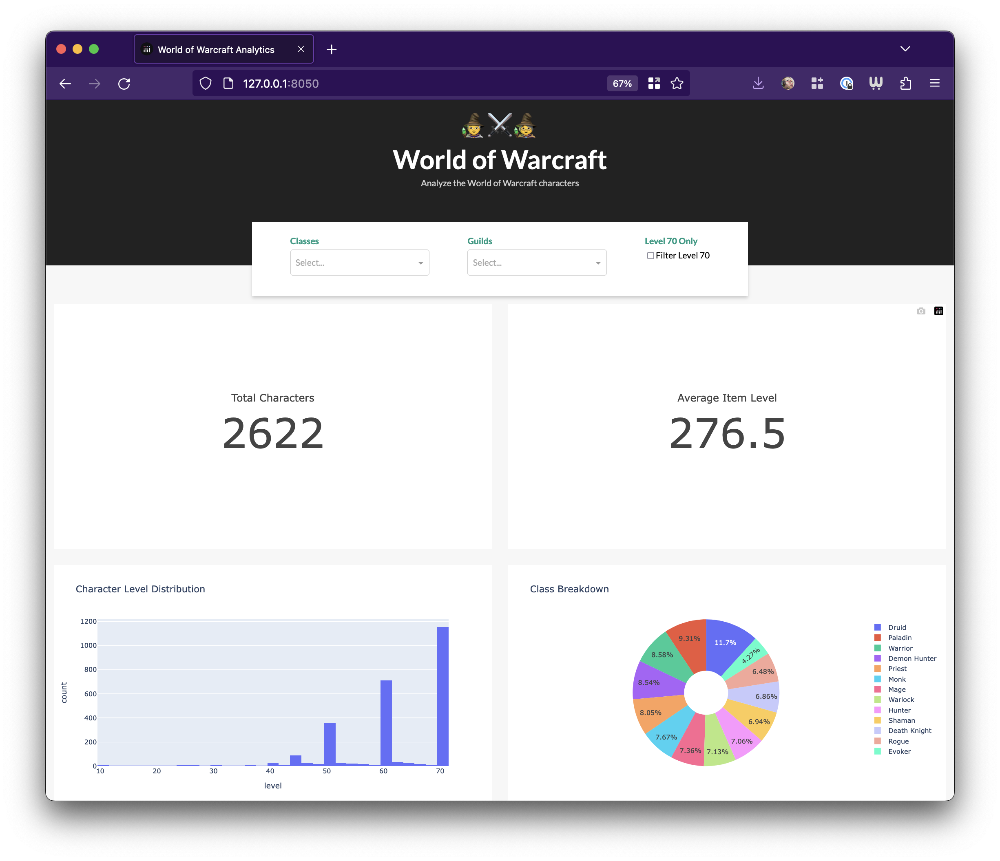

# WoW Guild Character Data Fetcher

This project fetches World of Warcraft character data for all members of a specified guild using Blizzard's Battle.net API. The output displays character details.



## Prerequisites

- Python 3.10+
- [Poetry](https://python-poetry.org/docs/#installation) (package manager)
- An active Battle.net API key (CLIENT_ID and CLIENT_SECRET)

## Setup

1. Clone the repository.
2. Navigate to the project directory and run the following command to install dependencies:
```bash 
poetry install
```
3. Activate the virtual environment:
```bash
poetry shell
```
4. Obtain the `CLIENT_ID` and `CLIENT_SECRET` for the Battle.net API by following [these instructions](https://develop.battle.net/documentation/guides/using-oauth/authorization-code-flow).
5. Create a `.env` file in the project root directory with the following content:
```yaml
CLIENT_ID=your_client_id
CLIENT_SECRET=your_client_secret
```
Replace `your_client_id` and `your_client_secret` with the actual values obtained in step 4.

## Importing guilds

To fetch character information for a specific realm and guild, run the `import.py` script with the following command:
```bash
python import.py <realm> <guild>
```

Replace `<realm>` and `<guild>` with the desired realm and guild names, respectively. This will store the fetched character data in `characters.duckdb` in the project root directory.

## Import WoW Progress's guild list

```bash
./import_top_guilds.sh
```

## Running the Dashboard

```bash
python app.py
```


